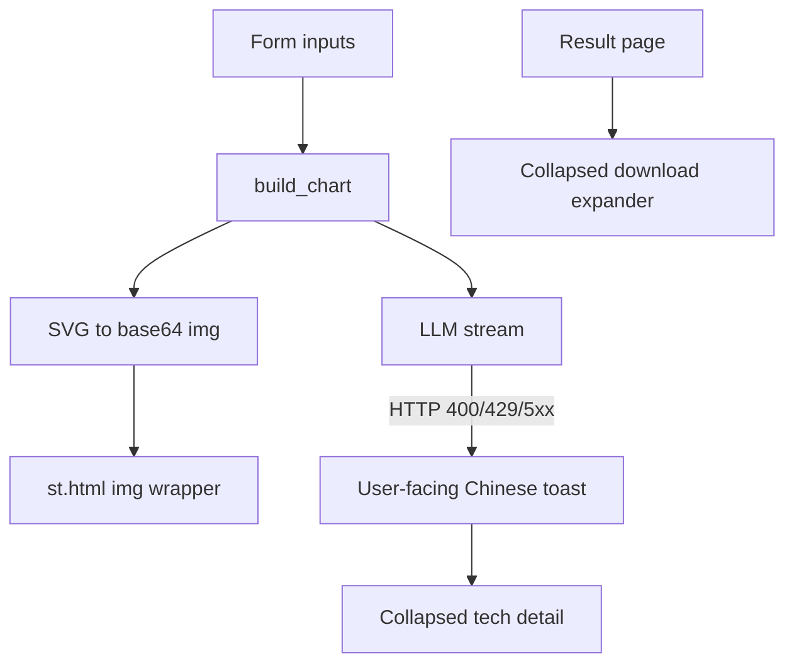

# log20260727 — 星盘可见性 + 表单 UX 五项修复

> 状态：**已实现**（2026-07-27）。  
> 来源：用户反馈（星盘不可见、城市拼音歧义、阴历/阳历、400 原文、下载是否隐藏）。  
> 关联：`app.py` / `chart.py` / `tests/test_design_system.py` / `tests/test_friendly_errors.py` / `agent.md` / `SHIP.md` / `history.md`

## 根因与默认决策

| # | 问题 | 根因 / 决策 |
|---|---|---|
| 1 | 电脑/手机都看不到星盘 | `_render_svg` 用 `st.html` 内嵌裸 `<svg>`；Streamlit DOMPurify **会剥掉 SVG 标签**，页面只剩空壳。上次为躲 iframe 测高改成 `st.html`，反而把图画没了。 |
| 2 | 陕西 / 山西拼音易混 | GeoNames 吃拼音时 `Shanxi` ≠ `Shaanxi`，用户不知双 a；文案 + 示例消歧（不新开省份字段）。 |
| 3 | 阴历 / 阳历 | 排盘按 **公历（阳历）**；表单项与 caption 写死说明。 |
| 4 | 400 等技术报错 | 用户面只显示友好/俏皮文案；原始错误进折叠「技术详情」，方便自查。 |
| 5 | 下载是否隐藏 | **默认折叠**：`st.expander("下载报告（可选）", expanded=False)`，功能保留、主路径不抢镜。 |



---

## 1. 星盘：base64 `` 内联

改 `app.py` 的 `_render_svg`：

- 完整 SVG（含 kerykeion `<style>` / `<defs>`）做 `base64`
- `st.html` 渲染：

```html
<div class="zx-natal-chart">
  
</div>
```

- 保留 `.zx-natal-chart`（`max-width:640px`、圆角、底色）
- **禁止** `st.iframe`（手机测高）；**禁止** 裸 `<svg>` 进 `st.html`

测试：`tests/test_design_system.py` 断言含 `data:image/svg+xml;base64,` 与 `zx-natal-chart`，且无 `st.iframe(`。

---

## 2. 城市：陕西 / 山西消歧

改 `chart.py` `PLACE_HINT` 与 `app.py` 城市字段：

- 优先拼音或英文城市名；中国可试中文市名（GeoNames + `nation=CN`）
- 专条：山西 → `Taiyuan` / `Shanxi`；陕西 → `Xi'an` / `Shaanxi`（双 a）
- placeholder：`如 Shanghai、Xi'an、Taiyuan`
- 地点错误用户文案指向同一提示；技术原文走第 4 项

不做省份下拉。

---

## 3. 出生日期：标明公历

- label：`出生日期（公历）`
- help/caption：`请填阳历（公历），与身份证/日历一致；暂不支持阴历换算。`

---

## 4. 用户友好错误

- 识别 `400` / `401` / `403` / `429` / `500` / `502` / `rate` / `quota` 等
- 映射示例：
  - 429 → `系统访问有点忙，请稍候再试。`
  - 5xx → `系统已躺下，晚安💤`
  - 地点 400 → 复用城市提示
  - 其它 API → `解读服务暂时不可用，请稍后再试。`
- 排盘 / 主报告 / §4 补全 / 塔罗：`st.error(friendly)` + 折叠 `原始错误：{exc}`

---

## 5. 下载区折叠

```python
with st.expander("下载报告（可选）", expanded=False):
    # HTML + PDF download buttons + caption
```

结果页顺序：摘要 → 人设卡 → **下载（折）** → 星盘 → 报告 → 塔罗。

---

## 文档与验证（实现时）

- `history.md` 一行；`SHIP.md` 自测加「手机可见星盘 + 公历文案」
- `agent.md`：星盘规则改为「SVG 经 base64 ``，禁止裸 SVG 进 `st.html`」
- `python -m unittest discover -s tests`
- 本地出报告：桌面/窄宽都有星盘；坏 key / 错城市见友好句 + 可展开技术详情

## 实现待办

- [x] Rewrite `_render_svg` to base64 img；更新 design_system 测试
- [x] 公历 label + 陕西/山西消歧 PLACE_HINT/caption
- [x] API/place 错误 → 中文用户句 + 技术 expander
- [x] 下载按钮包进默认折叠 expander
- [x] 同步 history / SHIP / agent

---

**后续（同日复用本日志风格）：** 导师批次、统计与白羊 16 卡 → [`log20260727_mentor.md`](log20260727_mentor.md)。
